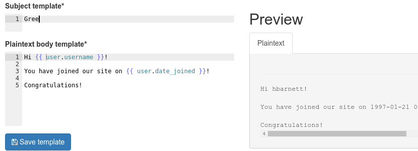

# django-massmailer

[](https://travis-ci.com/prologin/django-massmailer)
[](https://www.gnu.org/licenses/gpl-3.0)

`django-massmailer` is a standalone Django app that you can plug in your
website to send e-mails in bulk. It features:

- An **e-mail template engine** to write your e-mail template, supporting both
  plaintext and HTML, with a live preview:

    

- A **query language** to select the subset of users you want to send e-mails
  to, and preview the list of selected users:

    

- A **batch status report** that shows how many e-mails have been sent, and is
  able to track bounces.

    


## Installation

First, install `django-massmailer` and its Python dependencies:

```
pip install django-massmailer
```

Then, add `massmailer` and its 3 Django dependencies to your project's
`INSTALLED_APPS`:

```python
INSTALLED_APPS = (
    # ...
    'massmailer',
    'crispy_forms',
    'django_bootstrap_breadcrumbs',
    'reversion',
)
```

Add the following URL pattern to your `urls.py` to put the mailing
dashboard in `/mailing`:

```python
urlpatterns = [
    # ...
    path('mailing', include('massmailer.urls')),
]
```

You also need to have a working Celery setup with your website.
You can check out the [official
tutorial](https://docs.celeryproject.org/en/latest/django/first-steps-with-django.html)
to setup Celery in your Django site, or just look at how we do it in our demo
application:

- [`demoapp/__init__.py`](demoapp/demoapp/__init__.py)
- [`demoapp/celery.py`](demoapp/demoapp/celery.py)
- [`demoapp/settings.py`](demoapp/demoapp/settings.py)

## Documentation

TODO

## Contributing

TODO

## Licence

`django-massmailer` is distributed under the GPLv3 licence.

- Copyright (C) 2016 Alexandre Macabies
- Copyright (C) 2016 Antoine Pietri

This program is free software: you can redistribute it and/or modify
it under the terms of the GNU General Public License as published by
the Free Software Foundation, either version 3 of the License, or
(at your option) any later version.

This program is distributed in the hope that it will be useful,
but WITHOUT ANY WARRANTY; without even the implied warranty of
MERCHANTABILITY or FITNESS FOR A PARTICULAR PURPOSE.  See the
GNU General Public License for more details.

You should have received a copy of the GNU General Public License
along with this program.  If not, see <http://www.gnu.org/licenses/>.
